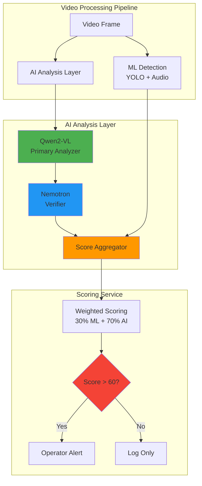
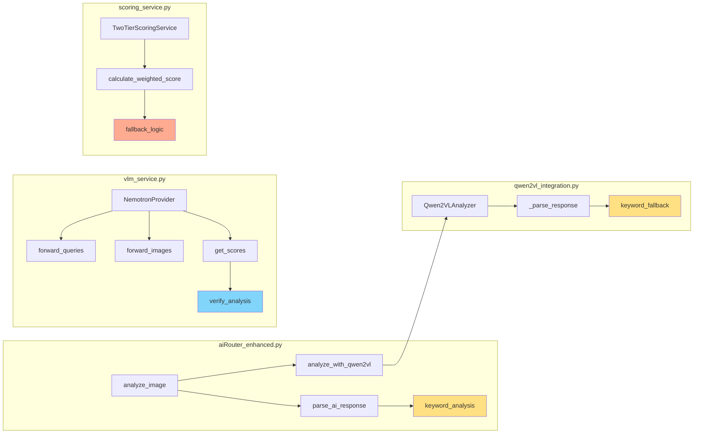
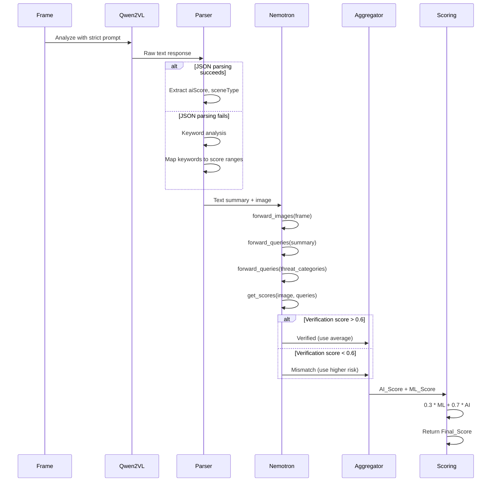

# Design Document: AI Scoring Improvements

## Overview

This design addresses three critical deficiencies in the current AI-powered threat detection system:

1. **Hardcoded Fallback Scores**: The current implementation uses fixed values (40, ml_score * 0.6) when AI models fail to return valid JSON, causing artificial clustering of threat scores regardless of actual risk level.

2. **Lenient Threat Classification**: The system currently allows "prank" and "drama" classifications that inappropriately downgrade real physical aggression in public surveillance contexts.

3. **Underutilized Nemotron Model**: The Nemotron ColEmbed V2 embedding model is loaded but never invoked in the analysis chain, missing an opportunity for secondary verification.

### Solution Approach

The design implements a three-layer verification architecture:

**Layer 1: Qwen2-VL Primary Analysis**
- GPU-accelerated vision-language model analyzes frames
- Strict prompt engineering eliminates lenient classifications
- Keyword-based fallback parsing replaces hardcoded scores

**Layer 2: Nemotron Embedding Verification**
- Computes similarity between Qwen2-VL's text summary and actual image
- Cross-validates scene classification using predefined threat queries
- Provides conservative risk adjustment when models disagree

**Layer 3: Weighted Score Aggregation**
- Combines ML_Score (30%) and AI_Score (70%) when both available
- Implements proper fallback logic without arbitrary multipliers
- Maintains audit trail of all component scores

### Key Design Decisions

**Decision 1: Embedding-Based Verification (Not Generative)**
- Nemotron ColEmbed V2 is an embedding model, not a chat/generative model
- Uses `forward_queries()`, `forward_images()`, and `get_scores()` methods
- Computes cosine similarity between text and image embeddings
- Rationale: Embedding similarity is faster and more reliable than generating new text

**Decision 2: Conservative Disagreement Handling**
- When Qwen2-VL and Nemotron disagree, use the higher risk score
- Flag for manual review rather than auto-resolving
- Rationale: In public safety contexts, false negatives are more costly than false positives

**Decision 3: Keyword-Based Fallback Scoring**
- Parse AI response text for threat indicators when JSON parsing fails
- Map keywords to score ranges (fight terms: 75-90, sport indicators: 20-35, normal: 10-25)
- Rationale: Preserves semantic information from AI response instead of defaulting to arbitrary values

## Architecture

### System Context



### Component Architecture



### Analysis Flow



## Components and Interfaces

### 1. Enhanced AI Router (`aiRouter_enhanced.py`)

**Responsibilities:**
- Orchestrate Qwen2-VL analysis
- Parse AI responses with keyword fallback
- Manage model initialization and error handling

**Key Functions:**

```python
def parse_ai_response(response_text: str, ml_score: float) -> Dict[str, Any]:
    """
    Parse AI response with keyword-based fallback (NO hardcoded scores).
    
    Args:
        response_text: Raw text from AI model
        ml_score: ML risk score for context
        
    Returns:
        {
            'aiScore': int (0-100),
            'sceneType': str ('real_fight' | 'organized_sport' | 'normal' | 'suspicious'),
            'explanation': str,
            'confidence': float (0-1)
        }
    """
    # Try JSON extraction first
    # If fails, use keyword analysis:
    # - Fight keywords without sport indicators: 75-90
    # - Sport indicators (gloves, referee, ring): 20-35
    # - Suspicious keywords (crowd surrounding, unknown items): 60-75
    # - Normal indicators: 10-25
    # NO hardcoded 40 or ml_score * 0.6
```

**Updated Prompts:**

```python
STRICT_THREAT_PROMPT = """Analyze this image for violence or fighting in a PUBLIC SURVEILLANCE context.

Classify as ONE of these categories:
1. REAL_FIGHT: Physical aggression, assault, or attack (NO protective gear)
2. ORGANIZED_SPORT: Boxing/martial arts WITH protective gear (gloves, headgear) AND referee/ring
3. SUSPICIOUS: Crowd surrounding two people (concealment behavior) OR unknown items in suspicious contexts
4. NORMAL: Safe activity, no threats

DO NOT classify as "prank" or "drama" - any physical aggression without sport indicators is REAL_FIGHT.

For REAL_FIGHT with heavy fighting (multiple strikes, sustained aggression, visible injury): Risk 80-95
For ORGANIZED_SPORT: Risk 20-35 (capped)
For SUSPICIOUS: Risk 60-75
For NORMAL: Risk 10-25

Respond in JSON:
{"aiScore": <0-100>, "sceneType": "<category>", "explanation": "<what you see>", "confidence": <0.0-1.0>}"""
```

### 2. Qwen2-VL Integration (`qwen2vl_integration.py`)

**Responsibilities:**
- Load and manage Qwen2-VL-2B-Instruct model
- Process frames with GPU acceleration
- Parse responses with keyword fallback

**Key Functions:**

```python
def _parse_response(self, response: str) -> Dict[str, Any]:
    """
    Parse Qwen2-VL response with keyword-based fallback.
    
    Keyword Mapping:
    - fight/violence/assault/punch/kick WITHOUT sport indicators → 75-90
    - boxing/training/sparring/gloves/referee → 20-35
    - crowd surrounding/unknown items → 60-75
    - normal/walking/standing/safe → 10-25
    
    Returns structured dict with aiScore, sceneType, explanation, confidence
    """
```

**Updated Prompts:**

```python
VIDEO_ANALYSIS_PROMPT = """Analyze this video for potential violence or fighting in PUBLIC SURVEILLANCE.

Classify ONLY as:
- real_fight: Physical aggression WITHOUT protective gear or referee
- organized_sport: Boxing/martial arts WITH protective gear AND referee/ring structure
- suspicious: Crowd surrounding people (concealment) OR unknown items
- normal: Safe activity

CRITICAL: Do NOT use "prank" or "drama" classifications.
Any fight without sport indicators = real_fight.

Heavy fighting (multiple strikes, sustained aggression, injury) = Risk 80-95

JSON format:
{"aiScore": <0-100>, "sceneType": "<type>", "explanation": "<observation>", "confidence": <0.0-1.0>}"""
```

### 3. Nemotron Embedding Verifier (`vlm_service.py`)

**Responsibilities:**
- Compute image and text embeddings
- Calculate similarity scores for verification
- Cross-validate scene classification

**Key Functions:**

```python
class NemotronProvider:
    def __init__(self):
        """Load Nemotron ColEmbed V2 embedding model (NOT generative)."""
        from transformers import AutoModel, AutoProcessor
        self.model = AutoModel.from_pretrained(
            "nvidia/nemotron-colembed-vl-4b-v2",
            trust_remote_code=True,
            torch_dtype=torch.float16 if torch.cuda.is_available() else torch.float32,
            device_map="auto"
        )
        self.processor = AutoProcessor.from_pretrained(
            "nvidia/nemotron-colembed-vl-4b-v2",
            trust_remote_code=True
        )
    
    def verify_analysis(self, image: Image, qwen_summary: str, qwen_scene_type: str) -> Dict[str, Any]:
        """
        Verify Qwen2-VL analysis using embedding similarity.
        
        Args:
            image: PIL Image
            qwen_summary: Text explanation from Qwen2-VL
            qwen_scene_type: Scene classification from Qwen2-VL
            
        Returns:
            {
                'verification_score': float (0-1),  # Image ↔ Qwen summary similarity
                'verified': bool,  # True if score > 0.6
                'category_scores': Dict[str, float],  # Image ↔ threat category similarities
                'nemotron_scene_type': str,  # Highest scoring category
                'nemotron_risk_score': int (0-100),  # Mapped from category similarity
                'agreement': bool,  # True if Nemotron and Qwen agree on scene type
                'recommended_score': int,  # Final recommended AI score
                'confidence': float  # Overall confidence
            }
        """
        # 1. Compute embeddings
        image_embedding = self.forward_images([image])
        summary_embedding = self.forward_queries([qwen_summary])
        
        # 2. Predefined threat category queries
        threat_queries = [
            "real fight with violence and aggression in public space",
            "organized sport with protective gear and referee",
            "normal safe activity with no threats",
            "suspicious crowd behavior covering people or unknown items"
        ]
        query_embeddings = self.forward_queries(threat_queries)
        
        # 3. Compute similarity scores
        verification_score = self.get_scores(image_embedding, summary_embedding)[0]
        category_scores = self.get_scores(image_embedding, query_embeddings)
        
        # 4. Determine Nemotron's classification
        category_map = {
            0: 'real_fight',
            1: 'organized_sport',
            2: 'normal',
            3: 'suspicious'
        }
        max_idx = np.argmax(category_scores)
        nemotron_scene_type = category_map[max_idx]
        
        # 5. Map similarity to risk score
        risk_map = {
            'real_fight': (80, 95),
            'organized_sport': (20, 35),
            'normal': (10, 25),
            'suspicious': (60, 75)
        }
        if category_scores[max_idx] > 0.7:
            risk_range = risk_map[nemotron_scene_type]
            nemotron_risk_score = int(np.mean(risk_range))
        else:
            nemotron_risk_score = 50  # Uncertain
        
        # 6. Determine agreement and recommendation
        verified = verification_score > 0.6
        agreement = nemotron_scene_type == qwen_scene_type
        
        if verified and agreement:
            # Both models agree and Qwen's description matches image
            recommended_score = int((qwen_risk_score + nemotron_risk_score) / 2)
            confidence = 0.9
        elif not verified or not agreement:
            # Mismatch or disagreement - use higher risk (conservative)
            recommended_score = max(qwen_risk_score, nemotron_risk_score)
            confidence = 0.5
        else:
            recommended_score = qwen_risk_score
            confidence = 0.7
        
        return {
            'verification_score': float(verification_score),
            'verified': verified,
            'category_scores': {
                'real_fight': float(category_scores[0]),
                'organized_sport': float(category_scores[1]),
                'normal': float(category_scores[2]),
                'suspicious': float(category_scores[3])
            },
            'nemotron_scene_type': nemotron_scene_type,
            'nemotron_risk_score': nemotron_risk_score,
            'agreement': agreement,
            'recommended_score': recommended_score,
            'confidence': confidence
        }
    
    def forward_images(self, images: List[Image]) -> torch.Tensor:
        """Compute image embeddings."""
        inputs = self.processor(images=images, return_tensors="pt").to(self.model.device)
        with torch.no_grad():
            embeddings = self.model.get_image_features(**inputs)
        return embeddings
    
    def forward_queries(self, queries: List[str]) -> torch.Tensor:
        """Compute text query embeddings."""
        inputs = self.processor(text=queries, return_tensors="pt", padding=True).to(self.model.device)
        with torch.no_grad():
            embeddings = self.model.get_text_features(**inputs)
        return embeddings
    
    def get_scores(self, image_embeddings: torch.Tensor, query_embeddings: torch.Tensor) -> np.ndarray:
        """Compute cosine similarity scores between image and query embeddings."""
        # Normalize embeddings
        image_norm = image_embeddings / image_embeddings.norm(dim=-1, keepdim=True)
        query_norm = query_embeddings / query_embeddings.norm(dim=-1, keepdim=True)
        
        # Compute cosine similarity
        scores = torch.matmul(image_norm, query_norm.T)
        return scores.cpu().numpy()
```

### 4. Scoring Service (`scoring_service.py`)

**Responsibilities:**
- Combine ML and AI scores with proper weighting
- Implement fallback logic without hardcoded multipliers
- Maintain audit trail of component scores

**Key Functions:**

```python
async def calculate_scores(self, frame, detection_data, context=None) -> Dict[str, Any]:
    """
    Calculate weighted final score with proper fallback logic.
    
    Scoring Logic:
    - Both available: Final = 0.3 * ML + 0.7 * AI
    - AI unavailable: Final = ML, confidence = 0.3
    - ML unavailable: Final = AI, confidence = 0.6
    - Nemotron adjustment: Use Nemotron-adjusted AI score in weighted calculation
    
    NO hardcoded 40 or ml_score * 0.6 multipliers.
    
    Returns:
        {
            'ml_score': float,
            'ai_score': float,  # Nemotron-adjusted if available
            'final_score': float,
            'ml_factors': Dict,
            'ai_explanation': str,
            'ai_scene_type': str,
            'ai_confidence': float,
            'nemotron_verification': Dict,  # Nemotron verification details
            'scoring_method': str,  # 'weighted' | 'ml_only' | 'ai_only'
            'confidence': float,
            'should_alert': bool
        }
    """
```

## Data Models

### AI Analysis Result

```python
@dataclass
class AIAnalysisResult:
    """Result from Qwen2-VL analysis."""
    ai_score: int  # 0-100
    scene_type: str  # 'real_fight' | 'organized_sport' | 'normal' | 'suspicious'
    explanation: str
    confidence: float  # 0-1
    provider: str  # 'qwen2vl' | 'ollama' | 'fallback'
    raw_response: str  # Original model output
    parsing_method: str  # 'json' | 'keyword'
```

### Nemotron Verification Result

```python
@dataclass
class NemotronVerification:
    """Result from Nemotron embedding verification."""
    verification_score: float  # 0-1, image ↔ Qwen summary similarity
    verified: bool  # True if verification_score > 0.6
    category_scores: Dict[str, float]  # Similarity scores for each threat category
    nemotron_scene_type: str  # Highest scoring category
    nemotron_risk_score: int  # 0-100, mapped from category similarity
    agreement: bool  # True if Nemotron and Qwen agree
    recommended_score: int  # Final AI score recommendation
    confidence: float  # 0-1
    latency_ms: int  # Processing time
```

### Final Scoring Result

```python
@dataclass
class FinalScoringResult:
    """Complete scoring result with all components."""
    ml_score: float  # 0-100
    ai_score: float  # 0-100 (Nemotron-adjusted)
    final_score: float  # Weighted combination
    ml_factors: Dict[str, Any]  # ML detection factors
    ai_analysis: AIAnalysisResult
    nemotron_verification: Optional[NemotronVerification]
    scoring_method: str  # 'weighted' | 'ml_only' | 'ai_only'
    confidence: float  # 0-1
    should_alert: bool
    timestamp: float
    camera_id: str
```

### Keyword Scoring Rules

```python
KEYWORD_SCORE_MAP = {
    # Fight keywords (without sport indicators): 75-90
    'fight_keywords': {
        'patterns': ['fight', 'fighting', 'violence', 'assault', 'attack', 'punch', 'kick', 
                     'hitting', 'striking', 'aggressive', 'aggression', 'brawl'],
        'score_range': (75, 90),
        'exclude_if_present': ['boxing', 'training', 'sparring', 'gloves', 'referee', 'ring', 'mat']
    },
    
    # Heavy fighting indicators: 80-95
    'heavy_fight_keywords': {
        'patterns': ['multiple strikes', 'sustained aggression', 'visible injury', 'blood', 
                     'weapon', 'knife', 'gun', 'severe'],
        'score_range': (80, 95)
    },
    
    # Sport indicators: 20-35
    'sport_keywords': {
        'patterns': ['boxing', 'martial arts', 'training', 'sparring', 'controlled', 
                     'protective gear', 'gloves', 'headgear', 'referee', 'ring', 'mat'],
        'score_range': (20, 35)
    },
    
    # Suspicious indicators: 60-75
    'suspicious_keywords': {
        'patterns': ['crowd surrounding', 'people covering', 'concealment', 'unknown item', 
                     'suspicious object', 'suspicious behavior'],
        'score_range': (60, 75)
    },
    
    # Normal indicators: 10-25
    'normal_keywords': {
        'patterns': ['normal', 'safe', 'walking', 'standing', 'talking', 'conversation', 
                     'no threat', 'peaceful'],
        'score_range': (10, 25)
    }
}
```

